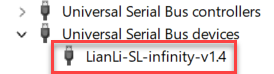
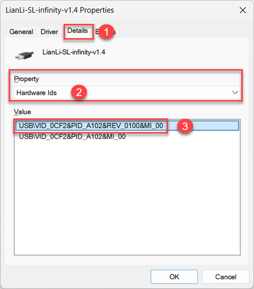
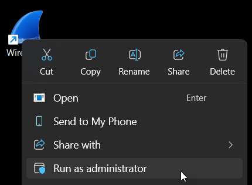
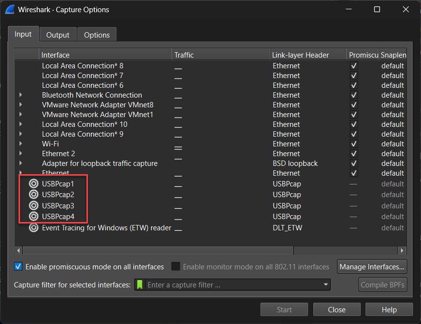
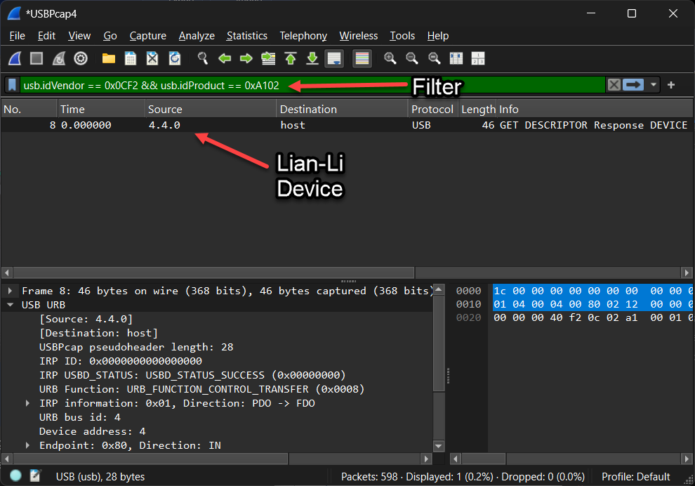
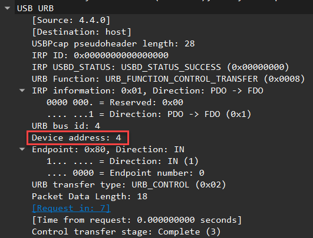
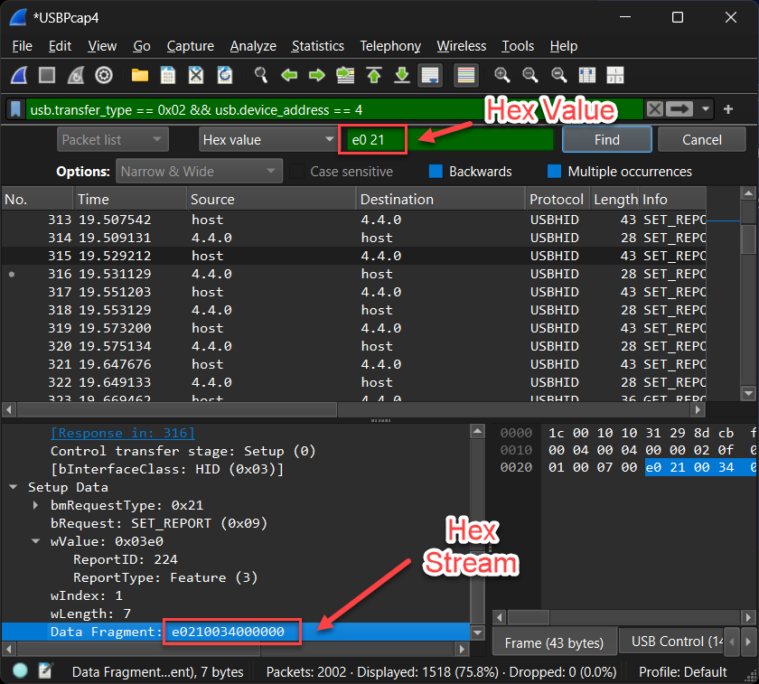

# Wireshark Capture Guide (Windows)

This guide shows how to capture USB traffic from L-Connect 3 on Windows to analyze Lian Li device protocols for the Linux port.

> Requires admin rights on Windows. Close other RGB tools to avoid noise.

## Install tools
1. **Install L-Connect 3** (required for device communication)
   - Download from [Lian Li website](https://lian-li.com/l-connect3/)
   - Install and ensure your Lian Li device is recognized
2. **Install Wireshark** (includes USBPcap)
   - Download from [Wireshark website](https://www.wireshark.org/)
   - During install, enable USBPcap driver
3. **Reboot** - USBPcap will not work as the driver needs a reboot

### Locate Lian Li Device
1. Open Device Manager (`Win + X` → Device Manager)
2. Look for these device categories:
   - **Universal Serial Bus controllers** → LianLi Device



### Extract Device Information
1. Right-click on the Lian Li device → **Properties**
2. Go to **Details** tab
3. From the dropdown, select **Hardware IDs**
4. Note down the **VID:PID** (Vendor ID:Product ID)
   - Example: `USB\VID_0CF2&PID_A102&REV_0100&MI_00`
   - VID = `0x0CF2`, PID = `0xA102`



> **Converting Hardware ID to Hex Values:**
> - Take the VID and PID directly from the string (already in hex format)
> - `VID_0CF2` → `0x0CF2` (add 0x prefix)
> - `PID_A102` → `0xA102` (add 0x prefix)
> - For Wireshark filters, use: `usb.idVendor == 0x0CF2 && usb.idProduct == 0xA102`

## Find the Lian Li Device in Wireshark

Once you know the correct **VID/PID** (for SL Infinity this is usually `0x0CF2:0xA102`), you can confirm you are on the right USBPcap interface and then lock onto its **device address** for action captures.

1. Launch Wireshark as adminstrator



2. You will need to choose a USB port and then specify the filter to make sure you have the right USB. In testing ports 1, 2, 3 didn't show anything and finally a hit took place on port 4 Using this usb-idVendor filter below. To change the ports Click Capture → **Stop** and then click on Click Capture → **Options** and choose the next port till you get a hit



```wireshark
usb.idVendor == 0x0CF2 && usb.idProduct == 0xA102
```


3. Now that we found the device we need to find the **Device address** in the example below we see it's device address 4



### Switch filter to device address
Now switch your filter to capture all packets for that device:
```wireshark
usb.device_address == 4
```
(replace `4` with the address you see in Wireshark).

### Focus on USB Control Transfers
Most commands (fan speed, RGB) are sent as USB control transfers. Use:
```wireshark
usb.transfer_type == 0x02 && usb.device_address == 4
```
This will show only the **control transfer** packets carrying the payloads you need for protocol mapping.

## Understanding the Command Packets

### Packet Structure
All commands use 64-byte packets starting with `e0`:
```
e0 [command] [parameters] [data...] [padding to 64 bytes]
```

### Fan Speed Commands
When you change fan speed, look for packets like:
```
e0 21 00 33 00 00 00...
e0 22 00 33 00 00 00...
e0 23 00 33 00 00 00...
e0 24 00 33 00 00 00...
```

**Decoding:**
- `e0` = Command prefix
- `21/22/23/24` = Port number (0x20 + port: 1,2,3,4)
- `00` = Reserved parameter
- `33` = Speed value (0x33 = 51% speed)
- `00 00 00...` = Padding to 64 bytes

### Port Mapping
- **Port 1**: `e0 21` (0x20 + 1)
- **Port 2**: `e0 22` (0x20 + 2)
- **Port 3**: `e0 23` (0x20 + 3)
- **Port 4**: `e0 24` (0x20 + 4)

### Speed Value Mapping
- `0x64` = 100% speed (max)
- `0x33` = 51% speed
- `0x19` = 25% speed
- `0x0c` = ~12% speed (min)

### How to Analyze Packets
1. **Right-click packet**
2. **Copy the hex data** from the stream
3. **Look for `e0` prefix** in the data
4. **Match the pattern** with your action
5. **Document the command** structure



## Mark actions with comments
- Use Wireshark "Packet Comment" (right-click packet → Packet Comment) to annotate start/end of each action.
- Example: "Action: Static Red", "Action: Brightness 50%".

## Save captures
- File → Save As → `captures/<device>/<YYYY-MM-DD>/<action>.pcapng`.
- Also export summary: File → Export Packet Dissections → As CSV → `captures/<device>/<YYYY-MM-DD>/<action>-summary.csv`.

## Extract control and interrupt transfers
Use Wireshark filters to view specific transfer types:

- Control setup/data:

```wireshark
usb.transfer_type == 0x02 || usb.setup_request
```

- Interrupt OUT (host → device):

```wireshark
usb.transfer_type == 0x01 && usb.endpoint_address.direction == 0
```

- Interrupt IN (device → host):

```wireshark
usb.transfer_type == 0x01 && usb.endpoint_address.direction == 1
```

## Capture checklist per action
- Record baseline (idle, app open, no changes).
- Set Static Red, Green, Blue.
- Set White.
- Change brightness levels (25/50/75/100).
- Change speed levels (min/mid/max).
- Switch a few modes (Rainbow, Static, Breathing).
- Apply per-port/zone changes if supported.

## Export raw payloads
In Wireshark, use "Follow USB stream" where applicable and copy raw bytes (hex). Keep a simple table in your capture log:

```
Time, Direction, Endpoint, Bytes (hex), Meaning
00:12.345, OUT, 0x02, 01 07 FF 00 00 00 00, Static Red
```

## Tips
- Prefer short, isolated captures focused on one action.
- If multiple devices are connected, map address → hub port by plugging/unplugging.
- Confirm firmware version; note it in the log.

See also: [Capture Log Template](templates/capture-log-template.md).
